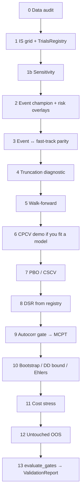

# Production Research Example — Learn Quantester Here

This folder is the **reference workflow** and the best place to learn the
framework. It walks one strategy from hypothesis → data → optimization →
leakage checks → selection-bias gates → Monte Carlo → walk-forward → untouched
OOS → a machine-readable `ValidationReport`.

```bash
# From the repository root
python examples/production_research/run.py          # demo scale (~20s)
python examples/production_research/run.py --full   # heavier MCPT / bootstrap
```

Artifacts land in `examples/production_research/output/` (gitignored).

---

## How to read the code (start here)

Read the four Python files in this order. Each file has a job:

| Order | File | What you learn |
| --- | --- | --- |
| 1 | [`strategy.py`](strategy.py) | How to write a `Strategy`: pure signal function + event form + vectorized twin |
| 2 | [`market.py`](market.py) | How we build a seeded synthetic OHLCV with a **planted** AR(1) edge |
| 3 | [`wiring.py`](wiring.py) | How the five Quantester modules connect (`DataHandler` → … → `FillEvent`) |
| 4 | [`run.py`](run.py) | The research checklist — `main()` calls stages `[0]`…`[13]` in order |

Every `stage_*` function in `run.py` starts with a header block:

```text
# WHAT: …   (what this stage does)
# WHY:  …   (why it exists in a research pipeline)
# NEED: …   (which Quantester symbols you must import)
# GATE: …   (pass/fail rule, when there is one)
```

You do **not** need prior Quantester knowledge. Follow `main()` top-to-bottom;
jump into a stage only when you want the detail.

---

## The five modules (wired in `wiring.py`)

```
DataHandler → Strategy → PortfolioManager → SimulatedExecutionHandler
                 ↑________ BacktestEngine event queue ________↑
```

Lifecycle on every bar: `MarketEvent → SignalEvent → OrderEvent → FillEvent`.

Rules you will see enforced in the code:

- Strategies talk **only** through `SignalEvent`s; they never read raw frames
  outside `DataHandler.get_latest_bars` / `get_current_open`.
- `delay=1`: signal on bar T close → fill at bar T+1 open.
- `fill_price` embeds spread/slippage/impact; cash is charged
  `qty × fill_price + commission` once (no double-counting `slippage_cost`).
- The vectorized twin (`momentum_positions` / `fast_backtest`) must
  **parity-match** the event engine under `FixedUnitSizer` before MCPT may
  use the fast-track.

---

## The research order (do not shuffle)



| Stage | One-line idea |
| --- | --- |
| `[0]` | Audit OHLCV before any signal |
| `[1]` | Optimize **only on IS**; log every real trial to `TrialsRegistry` |
| `[1b]` | Neighbors may be weaker; they must not be catastrophic |
| `[2]` | Full event-engine champion + risk overlays + tearsheet |
| `[3]` | Event equity ≈ fast-track equity (or MCPT is invalid) |
| `[4]` | Chop last N bars — position mismatch = look-ahead leak |
| `[5]` | Expanding train → lock params → score next test block |
| `[6]` | CPCV + triple-barrier API (N/A for our rule-based primary) |
| `[7]` | PBO from the trial PnL matrix — gate **PBO < 0.10** |
| `[8]` | Deflate champion Sharpe by honest N — gate **DSR ≥ 0.95** |
| `[9]` | Autocorr gate, then MCPT with re-optimize-on-permute — gate **p < 0.05** |
| `[10]` | Block bootstrap / nested DD bound / Ehlers paths |
| `[11]` | BASE ∧ CONSERVATIVE costs still viable (STRESS is diagnostic) |
| `[12]` | One shot on sealed OOS — no re-optimization |
| `[13]` | `evaluate_gates` → `ValidationReport` on disk |

---

## What the market is (and is not)

The series in `market.py` is **fiction with a known answer**. Persistence
(`phi > 0`) is injected so a delay-1 momentum rule has a chronological pattern
MCPT can falsify. Real markets will not gift you this. The point of the
example is the **shape of the process**, not the Sharpe number.

---

## Modules exercised

| Package | Symbols used here |
| --- | --- |
| `data` | `audit_ohlcv_frame`, `HistoricCSVDataHandler` |
| `strategy` | custom twin + `meta_labeling.triple_barrier_labels` |
| `portfolio` | `PortfolioManager`, `FixedUnitSizer`, `PercentEquitySizer`, `MarginMonitor`, `DailyDrawdownBreaker` |
| `execution` | `SimulatedExecutionHandler`, `CostModel`, `retail_cost_scenario` |
| `engine` | `BacktestEngine` |
| `analytics` | `summarize`, `annualized_sharpe`, `TrialsRegistry`, `dsr_from_registry`, `generate_tearsheet` |
| `validation` | `run_truncation_test`, `pbo_cscv`, `CombinatorialPurgedKFold`, `evaluate_gates`, `run_cost_stress` |
| `montecarlo` | `fast_backtest`, `permutation_test`, `autocorrelation_gate`, `adaptive_empirical_resample`, `bootstrap_ohlcv`, `double_bootstrap_dd_bound`, `ehlers_randomized_equity` |
| `visualization` | `plot_equity` |

---

## What “production grade” means here

1. **Hypothesis first** — vol-scaled momentum, delay-1, economic lookback grid.
2. **Firewall** — DataHandler + delay + open/close phases; no raw future bars.
3. **Twin** — vectorized path exists and parity-tests before MC.
4. **Honest N** — registry contains what you tried; DSR reads it.
5. **Selection math** — PBO on the actual trial matrix.
6. **Null math** — MCPT destroys chronology; edge must die under permutation.
7. **Path risk** — block bootstrap + nested DD bound after autocorr gate.
8. **Friction** — BASE/CONSERVATIVE must not erase the edge.
9. **Sealed OOS** — one shot.
10. **Paper trail** — `ValidationReport` on disk.

A green `VALIDATED` on this synthetic market means the *workflow* is intact.
It is **not** permission to size real capital.

---

## Typical demo-scale outcome (seed=8)

| Gate | Expected |
| --- | --- |
| Data audit | PASS |
| Truncation | PASS |
| Parity | PASS |
| Walk-forward | positive stitched Sharpe |
| PBO | < 0.10 |
| DSR | ≥ 0.95 |
| MCPT | p < 0.05 |
| Cost stress BASE/CONSERVATIVE | viable |
| Untouched OOS | positive Sharpe |
| Validation status | `VALIDATED` |

Re-run after changing seeds, costs, or grids — and believe the gates, not the
narrative.
