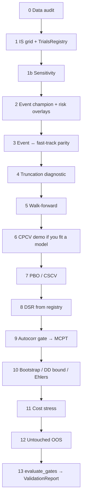

# Production Research Example — How a Strategy Earns Trust

This folder is the **reference workflow** for Quantester research. It is not
another “plot a backtest” demo. It walks a single strategy from hypothesis →
data → optimization → leakage checks → selection-bias gates → Monte Carlo →
walk-forward → untouched OOS → a machine-readable `ValidationReport`.

```bash
# From the repository root
python examples/production_research/run.py          # demo scale (~20s)
python examples/production_research/run.py --full   # heavier MCPT / bootstrap
```

Artifacts land in `examples/production_research/output/` (gitignored):
tearsheets, equity chart, walk-forward folds, `trials.db`,
`validation_report.txt` / `.json`, `summary.json`.

---

## What you are looking at

| Piece | Role |
| --- | --- |
| `market.py` | Seeded synthetic OHLCV with a **planted AR(1) momentum edge** |
| `strategy.py` | `TrendMomentumStrategy` + shared `momentum_positions` twin |
| `run.py` | Ordered research pipeline (stages `[0]`…`[13]`) |
| `README.md` | This document — the “why” behind each stage |

The market is **fiction with a known answer**. Persistence (`phi > 0`) is
injected so a delay-1 momentum rule has a chronological pattern MCPT can
falsify. Real markets will not gift you this. The point of the example is the
**shape of the process**, not the Sharpe number.

---

## Non-negotiable architecture (wired in `run.py`)

```
DataHandler → Strategy → PortfolioManager → SimulatedExecutionHandler
                 ↑________________ BacktestEngine event queue ________________↑
```

- Strategies talk **only** through `SignalEvent`s; they never read raw frames
  outside `DataHandler.get_latest_bars` / `get_current_open`.
- `delay=1`: signal on bar T close → fill at bar T+1 open.
- `fill_price` embeds spread/slippage/impact; cash is charged
  `qty × fill_price + commission` once (no double-counting `slippage_cost`).
- The vectorized twin (`vectorized_signals` / `momentum_positions`) must
  **parity-match** the event engine under `FixedUnitSizer` before MCPT is
  allowed to use the fast-track.

---

## The research order (do not shuffle)



### `[0]` Data audit — `quantester.data.audit`

Before any signal: timezone-aware UTC index, finite OHLCV, documented
adjustment / survivorship / calendar assumptions.
`DataAuditReport.passed` requires a clean **PASS** (WARN is not a pass).

### `[1]` In-sample grid → `TrialsRegistry`

Optimize **only on IS**. Log every trial you would actually consider — including
losers. Do **not** stuff known-junk decoys into the registry to game DSR
variance; reject bad families *a priori* and say so in the log.

Use an **economically spaced** grid (here ≈2w / 1m / 1q / 1y). A dense cluster
of near-identical lookbacks makes PBO → 1 by construction.

### `[1b]` Sensitivity

Neighbors on a spaced grid may be weaker. They must not be catastrophic.
Optional gate — but a FAIL still blocks `VALIDATED` today, so treat it seriously.

### `[2]` Event-engine champion

Full stack: `HistoricCSVDataHandler`, `TrendMomentumStrategy`,
`PercentEquitySizer`, `MarginMonitor`, `DailyDrawdownBreaker`,
`SimulatedExecutionHandler(CostModel)`, tearsheet + equity plot,
`accounting_invariant()`.

### `[3]` Parity

`FixedUnitSizer(units≈0.95·equity/price)` event run vs `fast_backtest`.
Max equity diff must be ~machine epsilon. No parity → no fast-track MCPT.

### `[4]` Truncation — `validation.truncation`

Chop the last N bars, re-run, compare overlapping positions. Mismatch ⇒
look-ahead leak; **everything else is void**.

### `[5]` Walk-forward

Expanding train → lock parameters → score the next test block (with indicator
warmup history). Stitch OOS fold returns. This is implemented here because
Quantester has purged CV helpers but no dedicated `WalkForward` class — you
compose it.

### `[6]` CPCV + triple-barrier (educational)

The primary rule **does not fit a model**, so CPCV is `NOT_APPLICABLE` on the
gate list. The stage still runs `CombinatorialPurgedKFold` +
`triple_barrier_labels` + logistic meta-labels to show the API you **must**
use the moment a secondary model is fitted.

### `[7]` PBO — `validation.pbo.pbo_cscv`

Synchronous trial PnL matrix → CSCV. Gate: **PBO < 0.10**.

### `[8]` DSR — `analytics.dsr.dsr_from_registry`

Deflate the champion’s **per-period** Sharpe by the registry’s honest N and
Sharpe variance. Gate: **DSR ≥ 0.95**. Pass `annualized=True` only if you
stored annualized Sharpes (this example stores daily).

### `[9]` Autocorr gate → MCPT

`autocorrelation_gate` first. Then `permutation_test` with an optimizer that
**re-selects lookback on every permuted path** via `fast_backtest`.
Masters p-value: `n_reps` includes the original (`p = count / n_reps`).
Gate: **p < 0.05**.

### `[10]` Resampling suite

`adaptive_empirical_resample`, `bootstrap_ohlcv` event-consistent paths,
`double_bootstrap_dd_bound`, `ehlers_randomized_equity` (avg_win/avg_loss
ratio — not gross profit factor).

### `[11]` Cost stress

`retail_cost_scenario("BASE"|"CONSERVATIVE"|"STRESS")`. This demo gates on
BASE∧CONSERVATIVE viability and still prints STRESS as a diagnostic ceiling.

### `[12]` Untouched OOS

Single evaluation of the locked champion. No re-optimization. Ever.

### `[13]` `evaluate_gates` → `build_validation_report`

`VALIDATED` only when mandatory gates are PASS (or N/A) with at least one
actionable PASS. All-N/A is **not** validated. Write
`validation_report.txt` / `.json`.

---

## Modules exercised

| Package | Symbols used in this example |
| --- | --- |
| `data` | `audit_ohlcv_frame`, `HistoricCSVDataHandler` |
| `strategy` | custom twin + `meta_labeling.triple_barrier_labels` |
| `portfolio` | `PortfolioManager`, `FixedUnitSizer`, `PercentEquitySizer`, `MarginMonitor`, `DailyDrawdownBreaker` |
| `execution` | `SimulatedExecutionHandler`, `CostModel`, `retail_cost_scenario` |
| `engine` | `BacktestEngine` |
| `analytics` | `summarize`, `annualized_sharpe`, `TrialsRegistry`, `dsr_from_registry`, `generate_tearsheet` |
| `validation` | `run_truncation_test`, `pbo_cscv`, `CombinatorialPurgedKFold`, `evaluate_gates`, `run_cost_stress` |
| `montecarlo` | `fast_backtest`, `permutation_test`, `autocorrelation_gate`, `adaptive_empirical_resample`, `bootstrap_ohlcv`, `double_bootstrap_dd_bound`, `ehlers_randomized_equity` |
| `visualization` | `plot_equity` |

Not every file in the repo is imported (e.g. live `yfinance` / `ccxt` feeds,
ETF trick, pairs). Those have their own examples; this one is the **governance
spine**.

---

## What “production grade” means here

1. **Hypothesis first** — vol-scaled time-series momentum, delay-1, economic
   lookback grid — not a 10,000-cell random search.
2. **Firewall** — DataHandler + delay + open/close phases; no raw future bars.
3. **Twin** — vectorized path exists and parity-tests before MC.
4. **Honest N** — registry contains what you tried; DSR reads it.
5. **Selection math** — PBO on the actual trial matrix.
6. **Null math** — MCPT destroys chronology; edge must die under permutation.
7. **Path risk** — block bootstrap + nested DD bound after autocorr gate.
8. **Friction** — BASE/CONSERVATIVE (and STRESS diagnostic) must not erase the edge.
9. **Sealed OOS** — one shot.
10. **Paper trail** — `ValidationReport` on disk.

A green `VALIDATED` on this synthetic market means the *workflow* is intact.
It is **not** permission to size real capital. On live data, expect gates to
fail; that is the system working.

---

## Typical demo-scale outcome (seed=8)

| Gate | Expected |
| --- | --- |
| Data audit | PASS |
| Truncation | PASS |
| Parity | PASS |
| Walk-forward | positive stitched Sharpe |
| PBO | < 0.10 |
| DSR | ≥ 0.95 |
| MCPT | p < 0.05 |
| Cost stress BASE/CONSERVATIVE | viable |
| Untouched OOS | positive Sharpe |
| Validation status | `VALIDATED` |

Re-run after changing seeds, costs, or grids — and believe the gates, not the
narrative.
